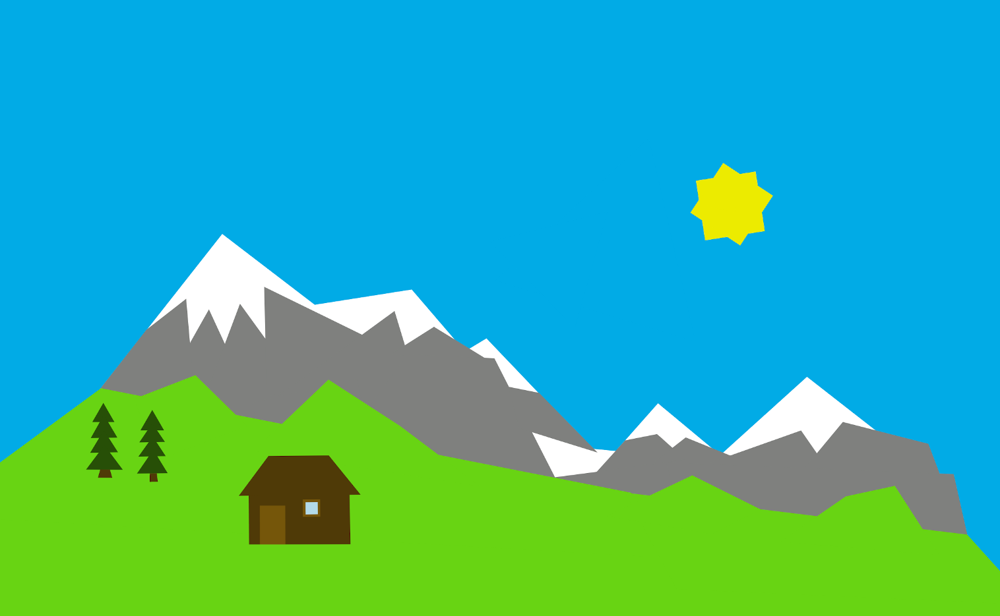

## svgcraft

The goal of svgcraft is to provide an infinite virtual two-dimensional space where people can meet, work, present, be creative, or just hang out.
In particular, we believe that the following kinds of interactions are impossible or underdeveloped in today's virtual conferencing and collaboration applications, and that svgcraft could improve on this:
- creating artwork with others, watching each other add to it, discussing each tweak as it's being made
- casually deciding who to talk to and listen to by walking around in a lobby
- reacting, waving, saying hi when crossing paths with someone
- laughing, frowning, applauding, yawning, nodding, etc while listening to someone's talk
- drawing on a whiteboard with a group of people and discussing by pointing at elements on the whiteboard
- listening to music with others and commenting on it, or singing along
- looking at someone's computer screen to discuss their work, pointing at items to discuss

At the moment, the only implemented feature is real-time collaborative editing of triangles and quadrilaterals, but that already makes it possible to host a virtual painting party and to paint pictures like these:

<p float="left">
  
  
</p>

In times of social distancing, or when we want to reduce our traveling to save the climate, svgcraft can hopefully provide some real-time social interaction to help with this.


### Users

To start a single user picture, go to https://svgcraft.github.io/.

To start a collaborative picture, go to https://svgcraft.github.io/gen_urls.html, click on a "Start a server" link, and then share the corresponding "Link to share" below it with the people you want to invite.


### Developers

All the code is written in modern JavaScript (ECMAScript 2019), and it turns out that this is a pretty neat programming language!

Contributions are welcome! This project is still in a very early stage, so there's unfortunately no documentation yet, but feel free to open an issue to ask for guidance or to discuss new features!

Tested only on Chrome 80.

For local development, using the `file://` protocol doesn't work due to cross-origin restrictions, so you have to set up a local server by running

```
python3 -m http.server
```

in this directory, and then go to http://0.0.0.0:8000/gen_urls.html
